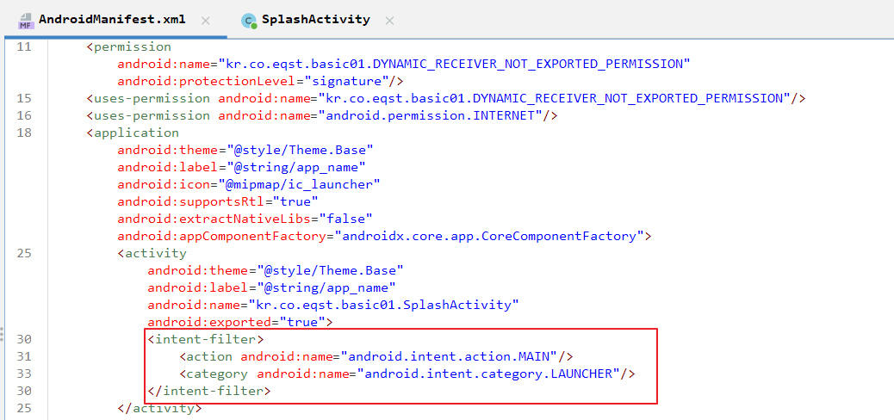
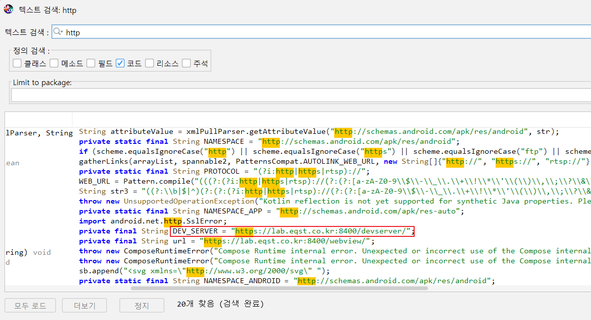
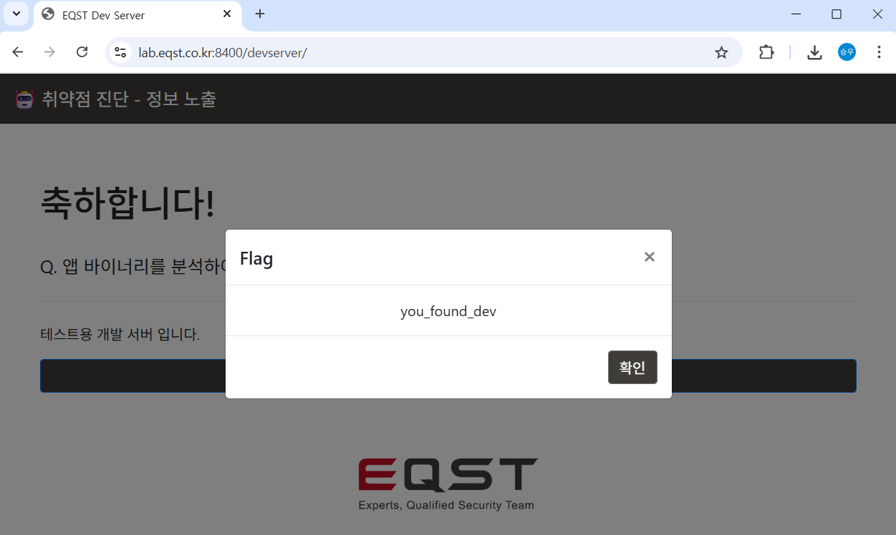

# LMS Android 풀이

## 중요정보 탈취

### 1번 문제
AndroidManifest.xml 파일을 분석하여 App 실행 시 처음으로 시작되는 Activity를 확인하세요.

런처에서 앱을 눌렀을 때 시작되는 액티비티는 manifest에서 <intent-filter>에 action이 android.intent.action.MAIN 이고 category에 android.intent.category.LAUNCHER 를 가진 Activity 이다.

답 SplashActivity

### 2번 문제

App 분석 후 개발용 서버 주소에 접근하여 FLAG를 확인하세요.

string으로 http 검색 시 바로 확인가능

### 3번 문제
